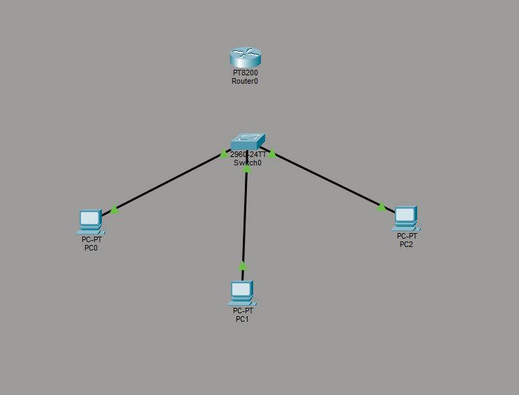

# Day 02

## Objectives

- Apply networking concepts using Cisco Packet Tracer.
- Understand how devices communicate on the same network.
- Learn how ARP works.
- Improve technical English.

---

## Study

Today I focused on applying the networking concepts learned on Day 01.

Topics reinforced:

- Local Area Networks (LAN)
- IPv4 Addressing
- Subnets
- MAC Address
- ICMP
- Ping
- ARP (Address Resolution Protocol)
- Ethernet Frames
- Default Gateway
- Router vs Switch

---

## Practical Lab

The objective of this lab was to build a simple Local Area Network (LAN) using Cisco Packet Tracer.

### Network Topology

The lab consists of:

- 3 PCs
- 1 Cisco 2960 Switch
- 1 Router (reserved for future routing labs)

### Activities Performed

- Configured static IPv4 addresses on all devices.
- Verified communication between hosts using the `ping` command.
- Used Simulation Mode to observe packet flow.
- Changed one device to a different subnet (`192.168.2.30`) to analyze communication failure.
- Identified that communication failed because the destination was on another subnet and no Default Gateway was configured.
- Examined the ARP table using the `arp -a` command and observed dynamically learned MAC addresses.

---

## English

Technical sentences practiced:

- I made a network simulation in Cisco Packet Tracer today.
- Without connectivity there is no communication.
- Every response starts with a request.
- A gateway is only necessary if devices need to communicate outside their local subnet.
- Ping uses the ICMP (Internet Control Message Protocol).

---

## Reflection

Today I moved beyond theory by observing how communication actually happens inside a network.

One of the most interesting concepts was ARP. I learned that before sending an ICMP packet, the computer must first discover the destination MAC address. Once the mapping is stored in the ARP table, future communication becomes faster because the device no longer needs to broadcast an ARP request.

Packet Tracer made these concepts much easier to visualize.

---

## Time

2 hours

---

## Status

- [x] Study
- [x] Practical Lab
- [x] English
- [x] Documentation