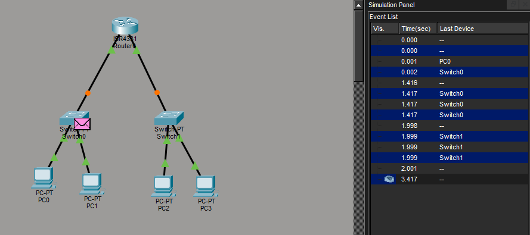
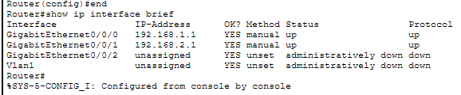

# Day 04 — Routing & Default Gateway

**Date:** 2026-07-09

## Topics Covered

- Router Fundamentals
- Default Gateway
- Next Hop
- Inter-network Communication
- Routing Basics
- ARP and Gateway Resolution
- Ethernet Frames Across Networks

---

## Practical Lab

Built a network with two different subnets using Cisco Packet Tracer.

Topology:

PC0 --- Switch0 --- Router --- Switch1 --- PC2

Additional hosts:

- PC1 (192.168.1.20)
- PC3 (192.168.2.20)

Router interfaces:

- G0/0/0 → 192.168.1.1
- G0/0/1 → 192.168.2.1

Tests performed:

- Successful ping between hosts on different networks.
- Configured Default Gateways.
- Observed routing through the router.
- Followed packet flow in Simulation Mode.
- Observed ARP resolving the MAC address of the Default Gateway.
- Verified that the router removes the incoming Ethernet Frame and creates a new one before forwarding the packet.

### Lab Images

---

---

---

## English

New words:

- Router
- Routing
- Default Gateway
- Next Hop
- Route
- Forward
- Forwarding
- Destination
- Source
- Interface

Practice sentences:

- A router forwards packets between different networks.
- The default gateway is used when the destination is outside the local subnet.
- ARP resolves the MAC address of the default gateway.
- The router creates a new Ethernet frame for the next network.

---

## Reflection

Today I understood how communication between different networks works.

One of the most important concepts I learned is that IP addresses remain the same from source to destination, while MAC addresses change at every hop because each router creates a new Ethernet frame.

---

## Time

2 hours

---

## Status

- [x] Study
- [x] Practical Lab
- [x] English
- [x] Documentation