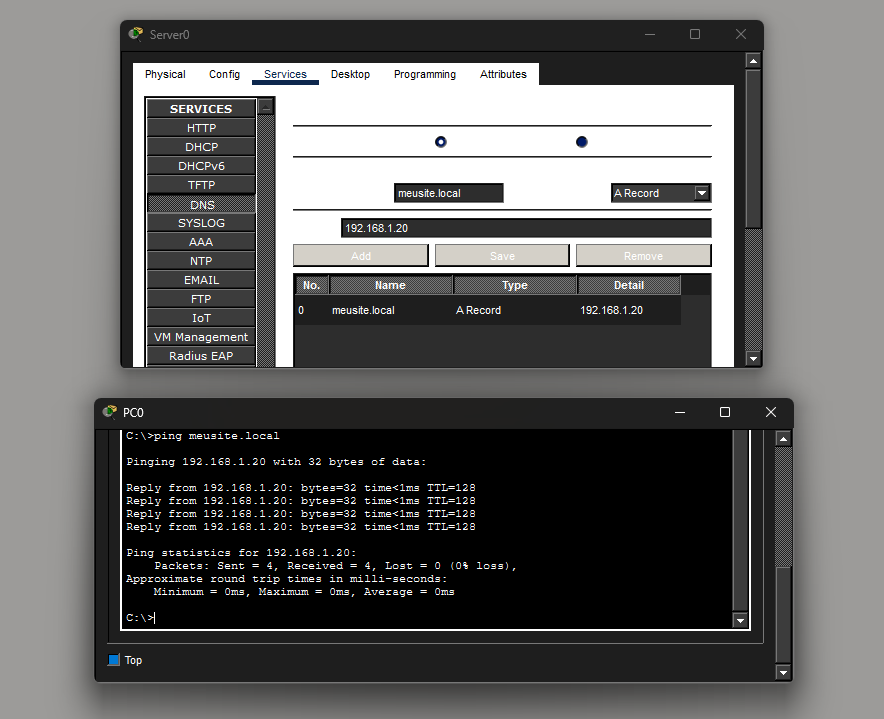

# Day 06 — DNS Fundamentals

**Date:** 2026-07-11

## Topics Covered

- DNS (Domain Name System)
- DNS Resolver
- DNS Records
- A Record
- AAAA Record
- CNAME
- MX Record
- DNS Cache
- DNS Queries
- UDP Port 53

---

## Practical Lab

Created a basic DNS infrastructure using Cisco Packet Tracer.

Topology:

PC0 ---- Switch ---- Server

Lab activities:

- Configured a DNS Server.
- Created an A Record (`meusite.local` → `192.168.1.20`).
- Configured the client to use the DNS Server.
- Successfully resolved the domain name using `ping meusite.local`.

Screenshot:

## Topology & DNS Resolution

---

## English

New words:

- Domain
- Hostname
- Resolver
- Record
- Query
- Response
- Cache
- Recursive
- Authoritative

Practice:

- DNS translates domain names into IP addresses.
- DNS usually uses UDP port 53.
- An A Record maps a domain to an IPv4 address.
- A Resolver performs DNS queries.

---

## Reflection

Today I learned how domain names are translated into IP addresses before communication begins.

I also understood that DNS is only responsible for name resolution. After obtaining the IP address, protocols such as ICMP, TCP, or UDP handle the communication.

---

## Time

2 hours

---

## Status

- [x] Theory
- [x] Practical Lab
- [x] English
- [x] Documentation