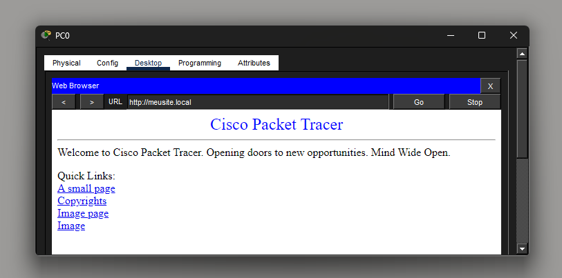

# Day 07 — HTTP & HTTPS Fundamentals

**Date:** 2026-07-12

## Topics Covered

- HTTP
- HTTPS
- TLS
- HTTP Request
- HTTP Response
- Headers
- Body
- HTTP Methods
- HTTP Status Codes
- Web Server

---

## Practical Lab

Built a simple web server using Cisco Packet Tracer.

Topology:

PC0 ---- Switch ---- Server

Lab activities:

- Configured an HTTP Server.
- Configured a DNS Server.
- Created an A Record (`meusite.local` → `192.168.1.20`).
- Accessed the web server using both its IP address and domain name.
- Understood the relationship between DNS and HTTP.

Screenshot:

## HTTP Request

---

## English

New words:

- Request
- Response
- Header
- Body
- Browser
- Server
- Secure
- Resource
- Method
- Status Code

Practice:

- HTTP uses TCP port 80.
- HTTPS uses TCP port 443.
- HTTPS protects communication using TLS.
- A browser sends an HTTP request.
- The server returns an HTTP response.

---

## Reflection

Today I learned how web browsers communicate with servers using HTTP and HTTPS.

I also understood how DNS, TCP, TLS, and HTTP work together to load a web page.

---

## Time

2 hours

---

## Status

- [x] Theory
- [x] Practical Lab
- [x] English
- [x] Documentation