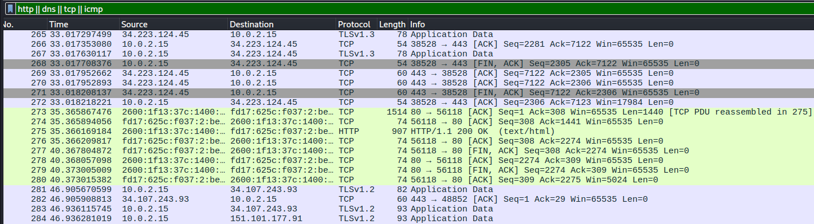
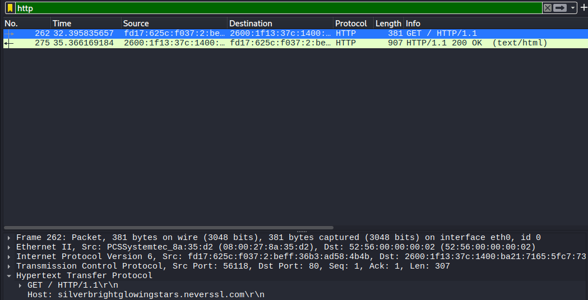

# Day 08 — Wireshark Fundamentals

**Date:** 2026-07-13

## Topics Covered

- Wireshark
- Packet Capture
- PCAP
- Packet Analysis
- Display Filters
- DNS
- TCP
- HTTP
- ICMP
- ARP

---

## Practical Lab

Captured real network traffic using Wireshark.

Activities:

- Captured ICMP traffic using ping.
- Captured DNS queries and responses.
- Captured HTTP requests and responses.
- Observed TCP Three-Way Handshake.
- Identified ARP traffic.
- Explored packet encapsulation from Ethernet to HTTP.

Screenshot:

## Wireshark Overview

## Wireshark Packet Analysis

---

## English

New words:

- Capture
- Frame
- Packet
- Payload
- Stream
- Analyze
- Interface
- Traffic
- Filter
- Handshake

Practice:

- Wireshark captures network traffic.
- HTTP uses TCP.
- DNS resolves domain names.
- ARP resolves MAC addresses.
- TCP establishes connections.

---

## Reflection

Today I connected all previous networking concepts by analyzing real packets with Wireshark. Seeing DNS, ARP, TCP, ICMP, and HTTP working together made the communication process much clearer.

---

## Time

2+ hours

---

## Status

- [x] Theory
- [x] Practical Lab
- [x] English
- [x] Documentation