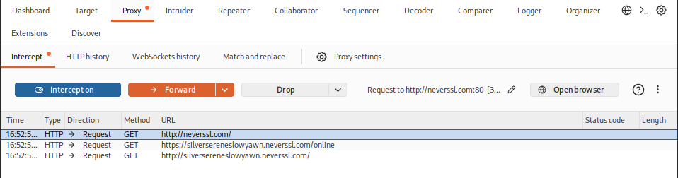
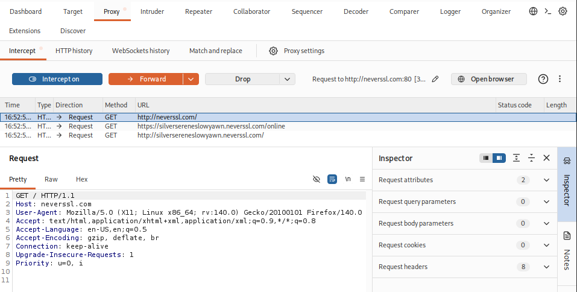

# Day 10 - Burp Suite Fundamentals

**Date:** 2026-07-15

## Topics Covered

- Proxy
- Burp Suite
- HTTP Request
- HTTP Response
- Headers
- Body
- GET
- POST
- Intercept
- Forward

---

## Practical Lab

- Configured Burp Suite Proxy.
- Intercepted HTTP requests.
- Inspected request headers.
- Identified HTTP methods.
- Forwarded requests to the server.
- Tested a local HTTP server using Python.

## Screenshot

### Proxy Overview 

Burp Suite Proxy intercepting browser requests.

### Burp Suite Interception

Inspection of an intercepted HTTP GET request, including request line and HTTP headers before forwarding it to the server.

---

## Key Concepts

- Burp Suite acts as an intercepting proxy.
- Requests can be inspected before reaching the server.
- Headers and Body contain different types of information.
- GET requests retrieve resources.
- POST requests send data to the server.

---

## Reflection

Today I learned how Burp Suite sits between the browser and the server, allowing HTTP requests and responses to be inspected and modified before they reach their destination. It became much clearer how web pentesters analyze web applications.