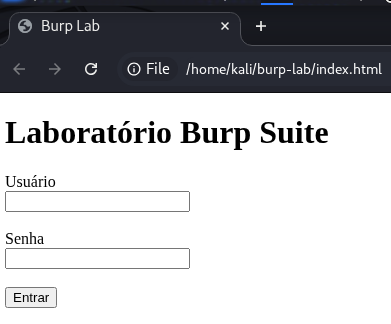
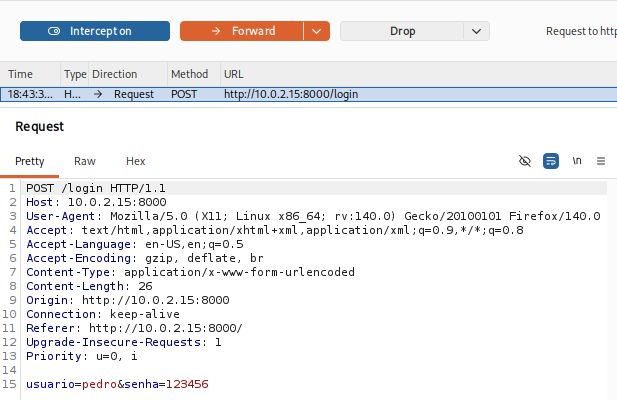
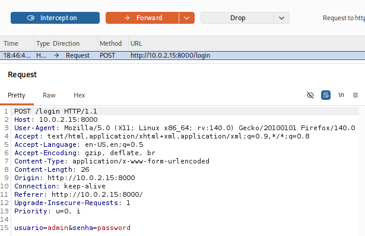

# Day 11 — HTTP Forms & Request Manipulation

**Date:** 2026-07-17

## Objectives

- Understand how HTML forms send data.
- Compare GET and POST requests in practice.
- Build a simple HTTP server in Python.
- Intercept POST requests with Burp Suite.
- Modify requests before they reach the server.

---

## Topics Covered

- HTML `<form>`
- POST requests
- Request Body
- application/x-www-form-urlencoded
- Content-Length
- Python `http.server`
- BaseHTTPRequestHandler
- Burp Suite Proxy
- Intercept
- Forward
- HTTP Request Manipulation

---

## Practical Labs

### Lab 1 — HTML Login Form

Created a simple login page containing:

- Username
- Password
- Submit button

Configured the form to send data using the POST method.



---

### Lab 2 — Python HTTP Server

Developed a custom HTTP server using Python's built-in libraries.

Implemented:

- GET handler
- POST handler
- Request parsing
- Dynamic response generation

---

### Lab 3 — Burp Suite Interception

Intercepted the POST request before it reached the server.

Observed:

- Request Line
- Headers
- Body
- Content-Type
- Content-Length



---

### Lab 4 — Request Manipulation

Modified the intercepted request.

Original:

```text
usuario=pedro
senha=123456
```

Modified:

```text
usuario=admin
senha=password
```

Forwarded the request and confirmed that the server received the modified values.



---

## Key Takeaways

- The browser does not decide what the server receives.
- Burp Suite allows requests to be modified before transmission.
- Servers must never trust client-side input.
- POST stores submitted data inside the request body.
- HTML forms are simply another way of generating HTTP requests.

---

## Skills Acquired

- HTML Forms
- POST Requests
- HTTP Body Analysis
- Burp Suite Proxy
- Request Interception
- Request Manipulation
- Python HTTP Server