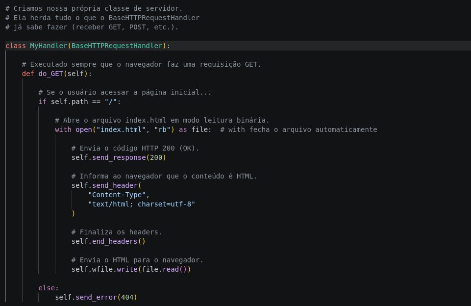

# Day 12 — Building an HTTP Server with Python (Part 1)

**Date:** 2026-07-20

## Objective

Understand how a Python HTTP server processes requests and responses instead of simply executing ready-made code.

---

## Topics Covered

- BaseHTTPRequestHandler
- HTTPServer
- Python imports
- UUID module
- In-memory session storage
- Classes
- Inheritance
- Basic object-oriented concepts
- HTTP GET request handling
- HTTP response generation
- Content-Type header
- HTTP Status Code 200
- HTTP 404
- Reading files with `with open()`
- Binary file reading (`rb`)
- HTTP response body

## Server Structure

The project started with the implementation of a custom HTTP server using Python's built-in `http.server` module.

The initial version implements:

- HTTP GET handling
- HTML file serving
- HTTP response generation
- Proper response headers
- Basic error handling (404)

Screenshot

## Annotated Python HTTP Server

---

## Code Walkthrough

During this session, each line of the server was analyzed individually instead of simply copying the implementation.

Key concepts covered:

- `BaseHTTPRequestHandler`
- Class inheritance
- `do_GET()`
- `self.path`
- `send_response()`
- `send_header()`
- `end_headers()`
- `wfile.write()`
- `with open()`

---

## What I Learned

- A class can inherit behavior from another class.
- `BaseHTTPRequestHandler` already knows how to process HTTP requests.
- `MyHandler` extends the default behavior.
- `do_GET()` is automatically executed when the server receives a GET request.
- `self.path` contains the requested URL path.
- `send_response()` generates the HTTP status code.
- `send_header()` creates HTTP response headers.
- `end_headers()` finishes the HTTP header section.
- `wfile.write()` sends the response body to the client.
- `with open()` automatically closes the file after use.

---

## Progress

- Server structure started.
- GET request flow understood.
- HTTP response structure analyzed.

## Time

2+ hours

## Status

- [x] Theory
- [x] Practical Lab
- [x] English
- [x] Documentation

---