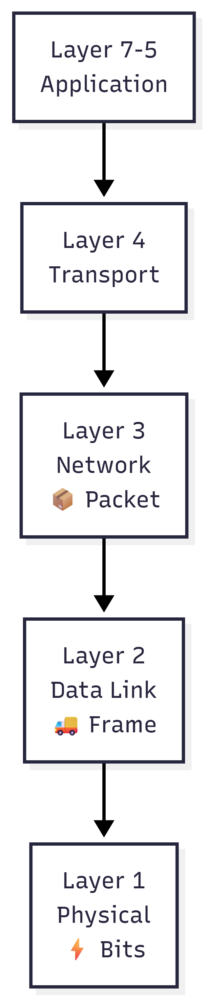
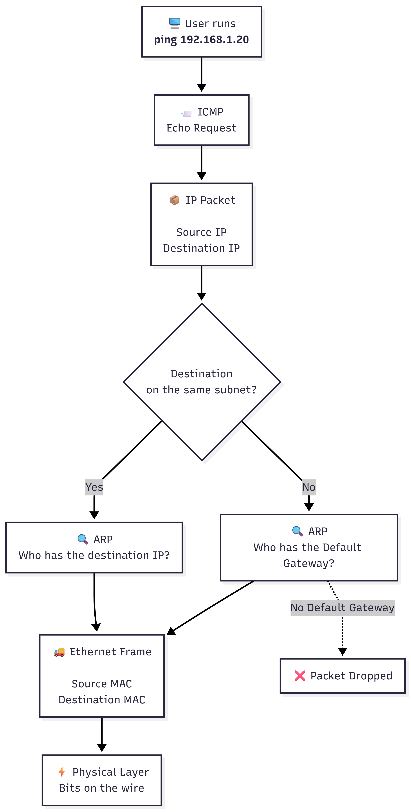

# Day 03 — OSI Model & Encapsulation

## OSI Model

The OSI (Open Systems Interconnection) Model is a conceptual framework that describes how data travels between devices on a network.

Each layer has a specific responsibility, allowing different hardware and software to communicate in a standardized way.



---

## Layer 1 — Physical

### Purpose

Responsible for transmitting raw bits over the physical medium.

### Examples

- Ethernet cables
- Fiber optic cables
- Wireless signals

### Data Unit

- Bits

---

## Layer 2 — Data Link

### Purpose

Responsible for communication inside the local network (LAN).

It identifies devices using **MAC Addresses** and creates **Ethernet Frames**.

### Main Device

- Switch

### Protocols

- Ethernet
- ARP

### Data Unit

- Ethernet Frame

---

## Layer 3 — Network

### Purpose

Responsible for communication between different networks.

Uses **IP Addresses** to determine where packets should be delivered.

### Main Device

- Router

### Protocols

- IPv4
- ICMP

### Data Unit

- Packet

---

# Encapsulation Process

When a user executes:

```bash
ping 192.168.1.20
```

the operating system prepares the data for transmission by encapsulating it through multiple network layers.

The ICMP Echo Request is first placed inside an IP Packet.

Next, the computer checks whether the destination belongs to the same subnet.

- If the destination is on the same subnet, ARP resolves the destination MAC Address.
- If the destination belongs to another network, ARP resolves the MAC Address of the Default Gateway instead.
- If no Default Gateway is configured, the packet is dropped before leaving the computer.

Finally, the IP Packet is encapsulated inside an Ethernet Frame and transmitted through the physical medium.



---

## ARP (Address Resolution Protocol)

ARP is responsible for translating an IP Address into a MAC Address.

It only works inside the local network.

If the destination device belongs to another subnet, ARP **does not** search for the destination host. Instead, it resolves the MAC Address of the Default Gateway, allowing the router to forward the packet.

> **Important:** ARP never crosses a router.

---

## Switch vs Router

### Switch

- Operates at Layer 2 (Data Link).
- Forwards Ethernet Frames.
- Uses MAC Addresses.
- Connects devices inside the same LAN.

### Router

- Operates at Layer 3 (Network).
- Routes IP Packets.
- Uses IP Addresses.
- Connects different networks.


---

## Key Concepts Learned

- The Switch works at Layer 2 using MAC Addresses.
- The Router works at Layer 3 using IP Addresses.
- Ethernet Frames belong to Layer 2.
- IP Packets belong to Layer 3.
- ARP resolves MAC Addresses only within the local network.
- When communicating with another network, the computer first resolves the MAC Address of the Default Gateway.
- Without a Default Gateway, packets destined for another subnet are dropped before leaving the computer.