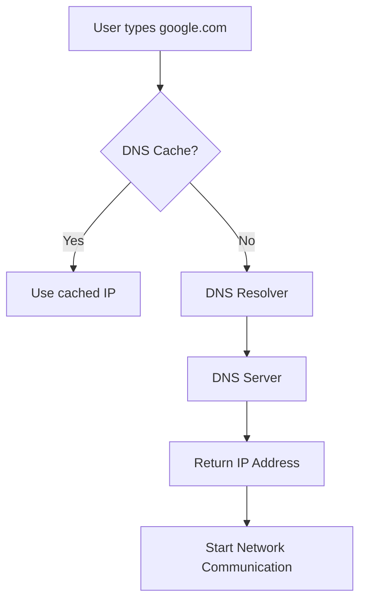

# DNS Fundamentals

## What is DNS?

DNS (Domain Name System) translates domain names into IP addresses.

Example:

google.com → 142.250.x.x

---

## Why DNS Exists

Humans remember names better than IP addresses.

DNS allows users to access services using domain names instead of numerical addresses.

---

## DNS Resolution Process

---

## DNS Resolver

The DNS Resolver performs queries on behalf of the client and returns the corresponding IP address.

---

## Common DNS Records

| Record | Purpose |
|---------|---------|
| A | Maps a domain to an IPv4 address |
| AAAA | Maps a domain to an IPv6 address |
| CNAME | Creates an alias for another domain |
| MX | Specifies the mail server for a domain |

---

## DNS Cache

The DNS Cache stores recently resolved domain names to reduce future lookup time.

---

## DNS Queries

- Recursive Query
- Iterative Query

---

## Key Points

- DNS uses UDP port 53 by default.
- DNS only resolves names.
- After resolution, communication continues using the resolved IP address.