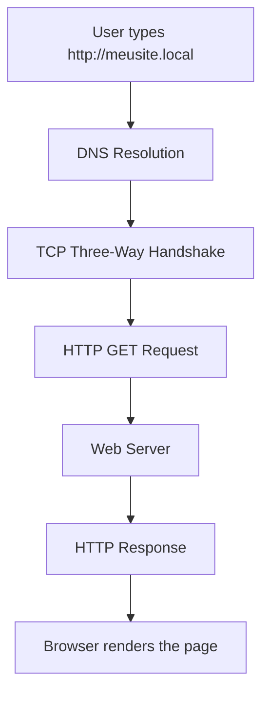

# HTTP & HTTPS Fundamentals

## HTTP

HTTP (HyperText Transfer Protocol) is an application-layer protocol used for communication between clients and web servers.

Default port:

- HTTP → TCP 80

---

## HTTPS

HTTPS is HTTP protected by TLS encryption.

Default port:

- HTTPS → TCP 443

---

## HTTP Communication Flow



---

## HTTP Methods

| Method | Purpose |
|---------|----------|
| GET | Retrieve data |
| POST | Send data |
| PUT | Update data |
| DELETE | Remove data |

---

## Common Status Codes

| Code | Meaning |
|------:|---------|
| 200 | OK |
| 301 | Moved Permanently |
| 400 | Bad Request |
| 403 | Forbidden |
| 404 | Not Found |
| 500 | Internal Server Error |

---

## Request Structure

```
Request

Header
↓

Body (optional)
```

---

## Response Structure

```
Response

Header
↓

Body (HTML, JSON, Image...)
```

---

## Key Points

- HTTP transfers web content.
- HTTPS encrypts communication using TLS.
- DNS resolves the domain before HTTP begins.
- HTTP depends on TCP.