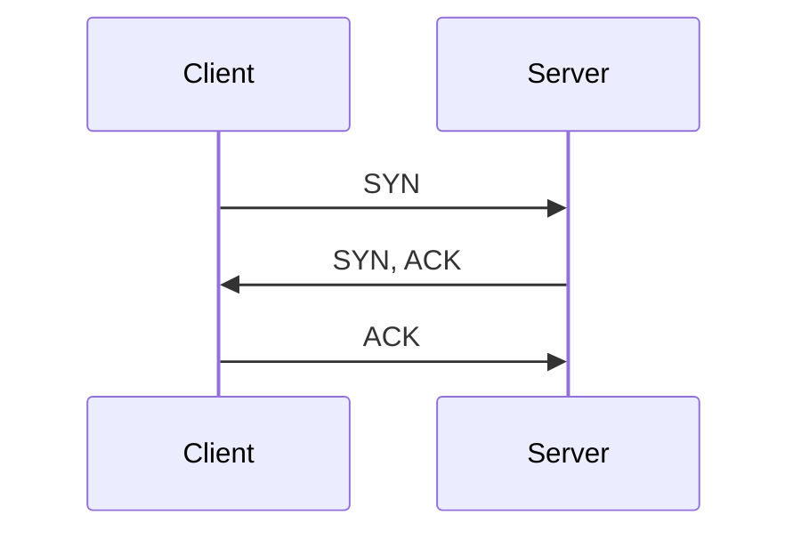
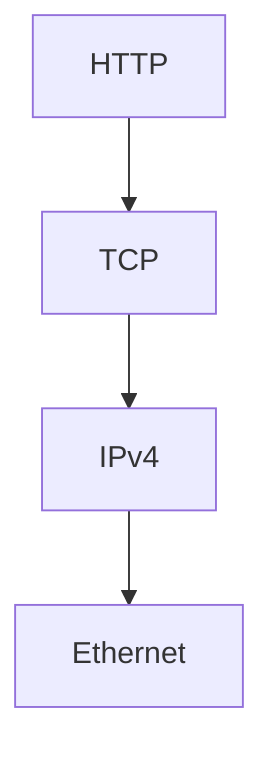

# Wireshark Fundamentals

## What is Wireshark?

Wireshark is a network protocol analyzer used to capture and inspect network traffic in real time.

---

## Packet Capture

A packet capture stores copies of network packets without interfering with communication.

Common formats:

- `.pcap`
- `.pcapng`

---

## Common Display Filters

```text
dns
tcp
http
icmp
arp
tls
ip
```

---

## TCP Three-Way Handshake



---

## Packet Encapsulation



---

## Packet Structure

Ethernet
- Source MAC
- Destination MAC

IPv4
- Source IP
- Destination IP
- TTL

TCP
- Source Port
- Destination Port
- Sequence Number
- ACK Number
- Flags

HTTP
- GET
- POST
- Headers
- Body

---

## TCP Flags

- SYN
- ACK
- PSH
- FIN

---

## Key Points

- Wireshark captures packets.
- Packets are displayed layer by layer.
- Display filters simplify packet analysis.
- HTTPS encrypts application data.
- DNS, ARP, TCP, and HTTP can be observed in real captures.